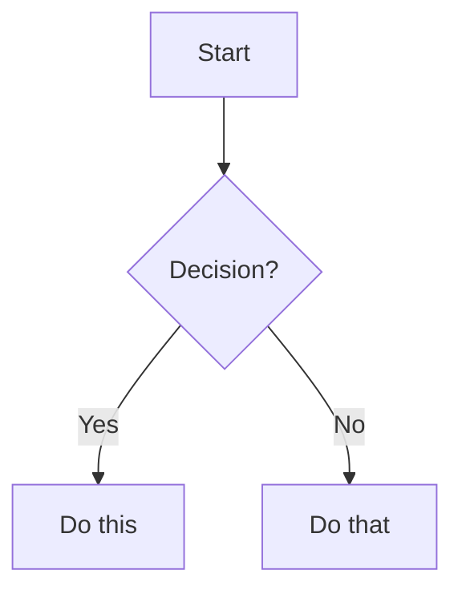

# Markdown Syntax Reference

A complete reference for the Markdown syntax supported by MDExport.

> **Tip:** Use the **Insert** menu or keyboard shortcuts (e.g. `Ctrl+B`, `Ctrl+T`) to drop these constructs in with a single keystroke. After insertion, press **Tab** to move between placeholders.

---

## Headings

Use 1–6 `#` characters at the start of a line.

````
# Heading 1
## Heading 2
### Heading 3
#### Heading 4
##### Heading 5
###### Heading 6
````

Setext-style (only for H1 and H2):

````
Title
=====

Section
-------
````

---

## Emphasis

| Syntax | Result |
|---|---|
| `*italic*` or `_italic_` | *italic* |
| `**bold**` or `__bold__` | **bold** |
| `***bold italic***` | ***bold italic*** |
| `~~strikethrough~~` | ~~strikethrough~~ |
| `==highlighted==` | ==highlighted== |
| `H~2~O` (subscript) | H~2~O |
| `x^2^` (superscript) | x^2^ |

---

## Inline code

Wrap with backticks. Use double backticks if your code itself contains a backtick.

````
Use the `printf()` function.
Use ``` `code` ``` to show literal backticks.
````

**Result:**

Use the `printf()` function. Use `` `code` `` to show literal backticks.

---

## Code blocks

**Fenced (preferred)** — three backticks, optional language for syntax highlighting:

`````
```python
def greet(name):
    return f"Hello, {name}!"
```
`````

**Result:**

```python
def greet(name):
    return f"Hello, {name}!"
```

**Indented** — four spaces or a tab:

````
    def greet(name):
        return f"Hello, {name}!"
````

---

## Links

````
[Inline link](https://example.com)
[Link with title](https://example.com "Hover title")
<https://example.com>          (autolink)
[Reference][ref]
[ref]: https://example.com "Optional title"
````

**Result:**

[Inline link](https://example.com), [Link with title](https://example.com "Hover title"), <https://example.com>, [Reference][ref].

[ref]: https://example.com "Optional title"

---

## Images

````


[](https://example.com)
````

The third form makes the image clickable.

---

## Lists

### Unordered

````
- Apple
- Banana
  - Plantain (nested)
- Cherry
````

- Apple
- Banana
  - Plantain (nested)
- Cherry

### Ordered

````
1. First
2. Second
3. Third
````

1. First
2. Second
3. Third

> Numbers don't have to be sequential — Markdown renumbers them. `1. 1. 1.` becomes `1. 2. 3.`.

### Task list

````
- [ ] Pending
- [x] Completed
- [ ] Another task
````

- [ ] Pending
- [x] Completed
- [ ] Another task

### Definition list

````
Term
: Definition of the term.

Another term
: Another definition.
````

Term
: Definition of the term.

Another term
: Another definition.

---

## Blockquotes

Prefix lines with `>`. Nest by repeating.

````
> A single-line quote.

> Multi-line
> blockquote
> spanning a paragraph.
>
>> Nested blockquote.
````

**Result:**

> A single-line quote.

> Multi-line
> blockquote
> spanning a paragraph.
>
>> Nested blockquote.

---

## Horizontal rule

Three or more `-`, `*`, or `_` on a blank line:

````
---
````

---

## Tables

### Pipe table

````
| Header 1 | Header 2 |
|----------|----------|
| Cell A   | Cell B   |
| Cell C   | Cell D   |
````

| Header 1 | Header 2 |
|----------|----------|
| Cell A   | Cell B   |
| Cell C   | Cell D   |

### Column alignment

Add `:` in the divider row.

````
| Left | Center | Right |
|:-----|:------:|------:|
| a    | b      | c     |
| d    | e      | f     |
````

| Left | Center | Right |
|:-----|:------:|------:|
| a    | b      | c     |
| d    | e      | f     |

### Grid table (with merged cells)

Markdig grid tables let you span columns (omit a `+` in a divider line) and rows (omit a `-`).

````
+---------+---------+---------+
| Region  | Q1      | Q2      |
+=========+=========+=========+
| North             | 220     |
+---------+---------+---------+
| South   | n/a               |
+---------+---------+---------+
````

### HTML table (rowspan / colspan)

For full control, drop into HTML.

````
<table>
  <thead>
    <tr><th>Region</th><th>Q1</th><th>Q2</th></tr>
  </thead>
  <tbody>
    <tr>
      <td rowspan="2">North</td>
      <td>100</td>
      <td>120</td>
    </tr>
    <tr>
      <td colspan="2" align="center">merged</td>
    </tr>
  </tbody>
</table>
````

**Result:**

<table>
  <thead>
    <tr><th>Region</th><th>Q1</th><th>Q2</th></tr>
  </thead>
  <tbody>
    <tr>
      <td rowspan="2">North</td>
      <td>100</td>
      <td>120</td>
    </tr>
    <tr>
      <td colspan="2" align="center">merged</td>
    </tr>
  </tbody>
</table>

---

## Footnotes

````
Some claim that needs sourcing[^source].

[^source]: Doe, J. (2024). *A Reference Work*.
````

**Result:**

Some claim that needs sourcing[^source].

[^source]: Doe, J. (2024). *A Reference Work*.

---

## Math

Mathematical expressions written with TeX syntax. (Renders in HTML/PDF when a math renderer is wired in; the raw form is preserved in DOCX.)

**Inline:**

````
The famous $E = mc^2$ equation.
````

**Block:**

````
$$
\int_a^b f(x)\,dx = F(b) - F(a)
$$
````

---

## Escapes

Backslash-escape any character that would otherwise be interpreted as Markdown:

````
\*not italic\*
\#not a heading
1\. not an ordered list
\\ literal backslash
````

**Result:**

\*not italic\*  
\#not a heading  
1\. not an ordered list  
\\ literal backslash

---

## Comments

HTML comments are supported. They are stripped from rendered output.

````
<!-- This won't appear in the rendered document. -->
````

---

## Raw HTML

Any HTML you write is passed through verbatim:

````
<div style="padding: 10px; background: #fafafa; border-left: 4px solid #888;">
  This is an HTML <strong>callout</strong>.
</div>
````

<div style="padding: 10px; background: #fafafa; border-left: 4px solid #888;">
  This is an HTML <strong>callout</strong>.
</div>

---

## Front matter

YAML metadata block at the very top of the document:

````
---
title: My Document
author: Jane Doe
date: 2026-01-01
tags: [markdown, reference]
---
````

Renderers either hide it or expose it as document metadata.

---

## Line breaks

A blank line separates paragraphs. Inside a paragraph, end a line with **two spaces** or a backslash for a hard line break:

````
Line one.  
Line two.

Line one.\
Line two.
````

---

## Admonition / callout

GitHub-flavoured callouts:

````
> [!NOTE]
> Useful information that should stand out.

> [!WARNING]
> Take care — something can go wrong here.
````

> [!NOTE]
> Useful information that should stand out.

> [!WARNING]
> Take care — something can go wrong here.

---

## Mermaid diagrams

Diagrams as code (rendered when a Mermaid runtime is present):

`````

`````

---

That's the full Markdown vocabulary supported by MDExport. Most exporters (HTML / PDF) honour everything above; DOCX export captures structure and inline formatting, but raw HTML and KaTeX math are passed through as plain text.
